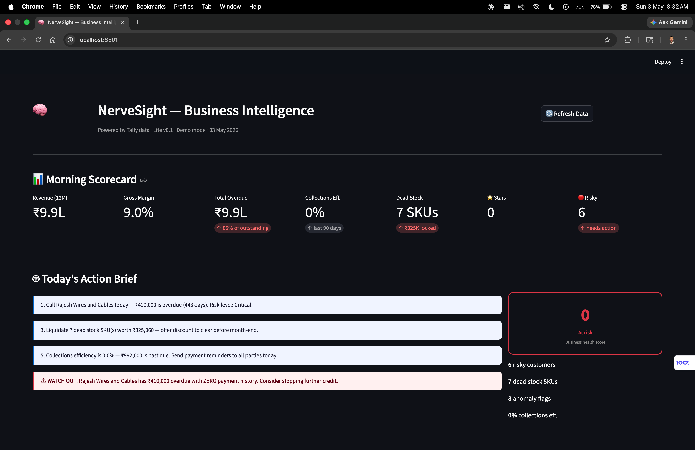

# NerveSight (Udyam Drishti)

**The AI analytics layer that turns a distributor's Tally data into prescriptive business intelligence — in under 10 minutes of setup.**

---

## The Problem

India has 63 million SME distributors. Every single one runs on Tally. And every single one makes their most important decisions — which customer to extend credit to, which product line to exit, which territory to double down on — entirely on gut feel.

The data to make these decisions correctly already exists. It sits inside Tally, untouched. Tally records what happened. It never tells you why, and never tells you what to do next. Every existing BI tool (Power BI, Zoho Analytics, SAP) is priced and designed for enterprises — too expensive, too complex, and completely blind to the realities of B2B trade in India: 60-day credit cycles, relationship-driven collections, and distributor margins that live or die on a 3% spread.

The result: Indian distributors lose an estimated **8–12% of gross margin annually** to decisions they already had the data to make correctly.

---

## What NerveSight Does

NerveSight plugs into the Tally installation a distributor already uses. Zero migration. Zero new data entry. It computes five things that every distributor needs but has never seen clearly:

- **Which customers are profitable** — not just who buys the most, but who actually makes you money after credit costs
- **Which SKUs are dead weight** — stock locked in your warehouse that hasn't moved in 60 days
- **Who owes you money and how badly** — receivables aging with AI-generated risk classification
- **30/60/90-day cash flow projection** — built from your actual outstanding invoices, not a spreadsheet formula
- **A daily action brief** — 3–5 specific things to do today, generated by Claude from your live data

> *"Rajesh Wires has ₹4.1L overdue with zero payment history — stop credit. Three SKUs worth ₹3.2L haven't moved in 90 days — liquidate before month-end."*

That's the product. No dashboards to configure. No training. One brief that changes every morning.

---

## Architecture

```
Tally Prime (port 9000)          NerveSight
─────────────────────            ─────────────────────────────────
Sales vouchers         ──────►  tally_connector.py   (XML/HTTP fetch)
Purchase vouchers      ──────►       │
Receipt vouchers       ──────►       ▼
Ledger master          ──────►  analytics/            (compute layer)
Stock item master      ──────►    ├── customer_intelligence.py
                                  ├── inventory.py
                                  ├── receivables.py
                                  └── cashflow.py
                                       │
                                       ▼
                                  llm_layer.py         (Claude API)
                                       │
                                       ▼
                                  main.py              (Streamlit UI)
```

**Stack:** Python · Streamlit · Anthropic Claude API · Tally XML/HTTP  
**Data surface:** 4 voucher types + party ledger + stock master. Nothing external required.  
**Deployment:** Local agent on distributor's machine. No cloud migration, no data leaves the premises unless opted in.

---

## Analytics Modules

| Module | What it computes | Tally source |
|---|---|---|
| A — Customer Intelligence | Revenue, gross margin, DSO, churn risk, tier (Star/Drain/Sleeper/Risky) | Sales vouchers + Ledger |
| B — SKU Health | Margin %, sales velocity, dead stock flag, return rate, quadrant classification | Sales + Purchase + Stock master |
| C — Receivables | Aging buckets (30/60/90/90+), overdue party list, collections efficiency | Sales + Receipt vouchers |
| D — Cash Flow | 30/60/90-day projected inflows and outflows, working capital trend | All voucher types |
| E — Anomaly Flags | Duplicate invoices, round-number concentration, GST mismatch signals | All voucher types |
| LLM Brief | Prescriptive daily action brief, Claude-generated from live data | Synthesis of A–E |

Modules F (Workforce ROI) and G (Commodity Price Signals) are on the roadmap pending customer validation.

---

## Quick Start

```bash
# 1. Clone and install
git clone https://github.com/shriman-maheshwari/nervesight
cd nervesight
pip install -r requirements.txt

# 2. Configure
cp .env.example .env
# Add ANTHROPIC_API_KEY to .env (optional — fallback insights work without it)

# 3. Run on sample data
streamlit run app/main.py
```

Opens at `http://localhost:8501`. Works immediately with the included sample dataset — a realistic anonymized electrical distributor with 7 customers, 7 SKUs, and 22 vouchers.

**To connect your own Tally installation:**

Enable Tally's HTTP server: `Gateway of Tally → F12 → Advanced Configuration → Enable HTTP Server → Port 9000`

Then in `.env`:
```
NERVESIGHT_MODE=live
TALLY_HOST=localhost
TALLY_PORT=9000
```

Or export XML directly from Tally (`Display → Day Book → Export → XML`) and point `NERVESIGHT_XML_PATH` at the file.

---

## Roadmap

**Now — v0.1 (current)**  
Static XML parsing, all five analytics modules, Streamlit dashboard, Claude-powered daily brief, full sample dataset.

**Next — v0.2 (post first paying customer)**  
Live Tally HTTP connection, automated daily refresh, WhatsApp/email delivery of the morning brief, Windows installer (where 95% of Tally runs).

**After 5 paying customers**  
Multi-company support for distributor groups, salesperson ROI module, commodity price signal integration (LME copper and aluminium — directly relevant to electrical and hardware distributors).

**Series A target**  
NerveSight as the financial operating system for India's B2B supply chain — connecting 63 million businesses to the data they already own.

---

## Background

I didn't find this problem in a market research report. I watched it happen for three years inside my family's B2B electrical distribution business — Shriman Electricals, Mumbai — starting at age 15.

The business had decades of transaction data in Tally and zero ability to ask it a question. Which customer segment is bleeding the balance sheet? Which product lines should we exit? Nobody knew. Every decision — credit extension, inventory purchase, territory expansion — was made on the founder's instinct alone, because there was no other option.

I built the first version manually. Spreadsheet trackers, hand-computed margin by customer segment, flagged one underperforming segment. The business acted on it and recovered margin. That spreadsheet is what NerveSight is becoming — except it runs automatically, updates daily, and costs less than one hour of a part-time accountant's time.

No other BI company is building this from inside a distribution business. That's the moat.

---

## Why Now

Tally Prime (2021) introduced a local HTTP API. For the first time, a third-party application can query a distributor's Tally data programmatically — no file access, no custom add-on required. The technical unlock happened three years ago. Nobody has built the right product on top of it yet.

---

## About

**Shriman Maheshwari** — Founder  
First-year CS, BITS Pilani · AI specialisation, CentraleSupélec Paris (Years 3–4)  
[shriman181@gmail.com](mailto:shriman181@gmail.com)

*Ideation stage · Seeking first 5 pilot customers in Mumbai electrical distribution · Open to co-founder with B2B SaaS scaling experience in India*

---

*India's distributors don't need another ERP. They need a brain. This is it.*
